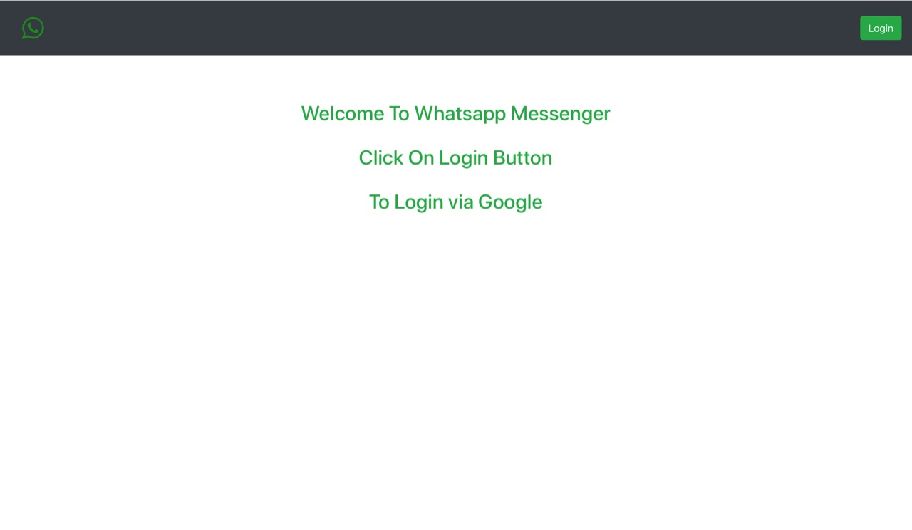
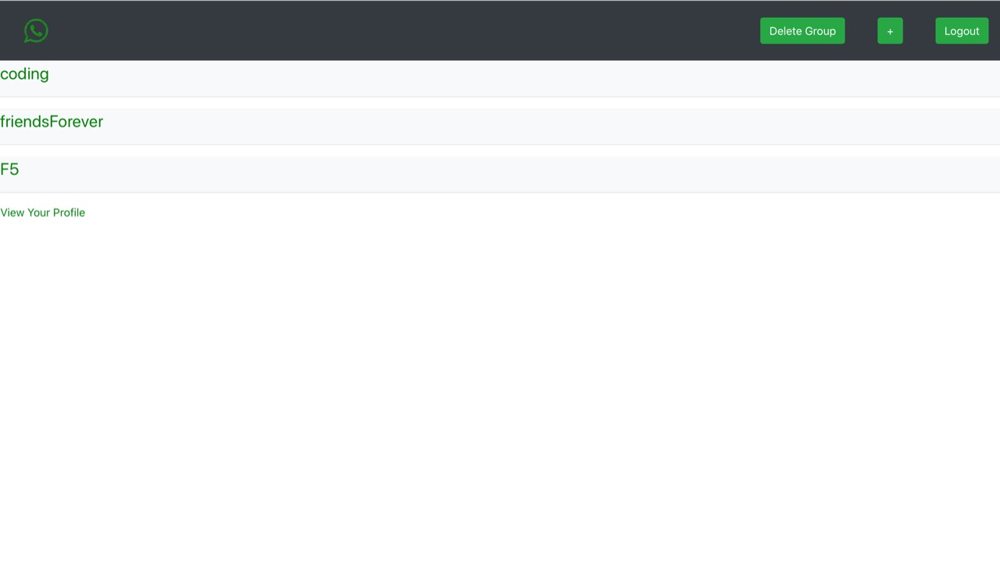
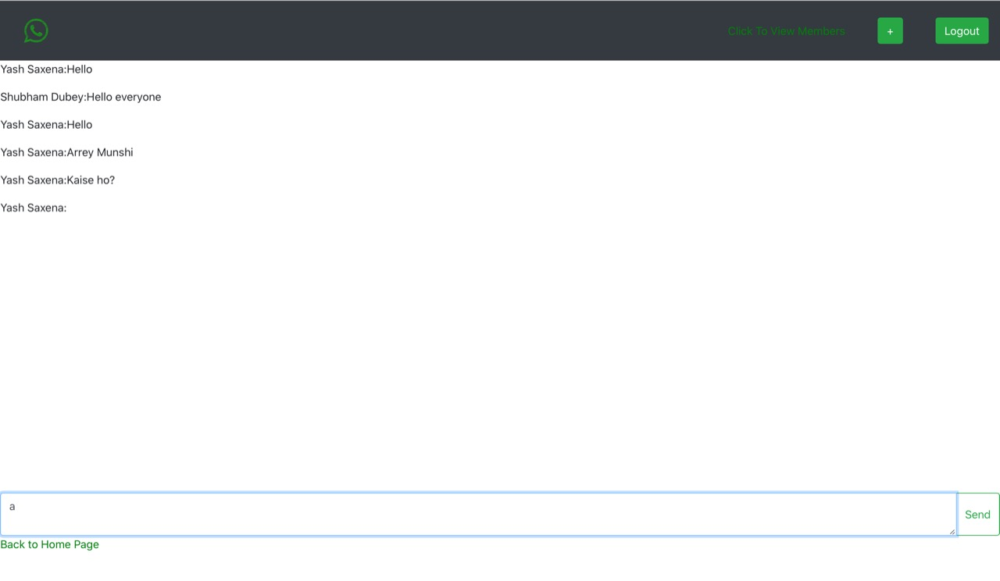
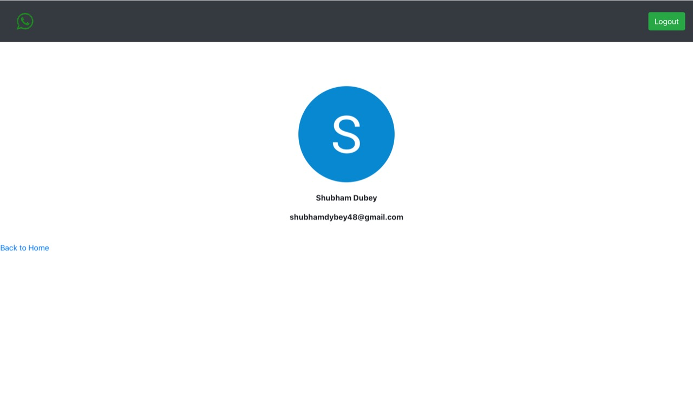

This is a chatting application that I have designed using ReactJS in the frontend and Firebase in the Backend.This web app has following features:

1)Login Page

The Login Page contains the Welcome Page along with the login option.A user can login via his/her Google Account.After successfully authentication the user will
be directed to Home Page.

2)Home Page

The Home Page contains groups in which a user is a part of or which he/she has creater.To demonstrate that I have created some groups and added my friends in it.
The Home Page also contains different options in the header such as Logout(which logs out a user),'+' button (indicates to create a new group),delete button (to delete a pre-existing group)
and also contains a link at the bottom via which a user can route to the profile page.From here the user can create different groups.Clicking on a group will route you to the
chatting Page.

3)Chat Page

The Chat Page is the primary point for communication.Here all the previous messages sent by the different members of the group are synced automatically from Firebase.
There is a text box at the bottom of the page where a user can type in new messages and send it in the group.The message sent is saved on Firebase and the moment you type in 
a new message,your last message is displayed along with your name.You can also add different people in the group with the help of their email-id.If he/she is a pre-existing member
then he/she will be added in the group.If invited member is not a pre-existing member then he/she will get a email with an invite link to join the chat app.A user can also view 
different members of the group also.

4)Profile Page

The profile page displays the image associated with your Google Account along with your email id which I am also using as a username.From profile page you can route back to the home page.
I have also hosted the chat app on the following url https://newchatapp-6c5ca.firebaseapp.com/

So guys keep chatting and do send me reviews on my email id shubhamdybey48@gmail.com
